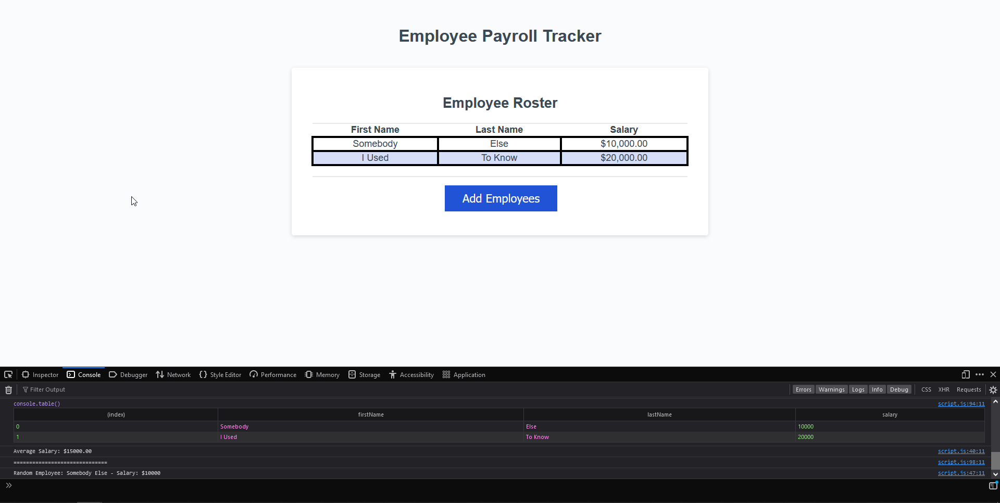

# Employee Payroll Tracker

## Goal: Modify starter code to make an employee payroll tracker
This repository should show that I can properly create alter some starter code to fill in and make functions work for the web page.

## Acceptance Criteria
- GIVEN an employee payroll tracker
- WHEN I click the "Add employee" button
- THEN I am presented with a series of prompts asking for first name, last name, and salary
- WHEN I finish adding an employee
- THEN I am prompted to continue or cancel
- WHEN I choose to continue
- THEN I am prompted to add a new employee
- WHEN I choose to cancel
- THEN my employee data is displayed on the page sorted alphabetically by last name, and the console shows computed and aggregated data

## Deployed Web Page
You can find the deployed web page for this project [here!](https://deceitfuldragon.github.io/employee-payroll-tracker/)

